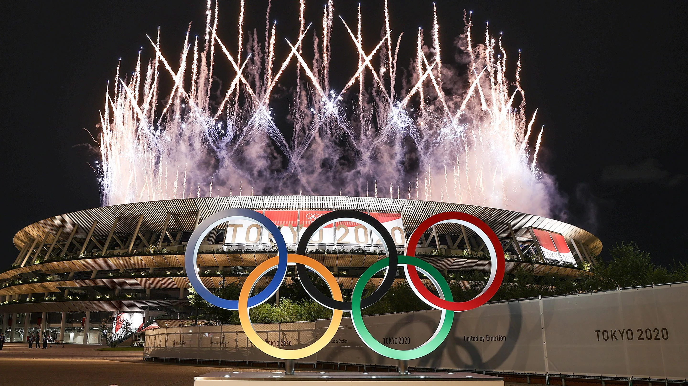

```{r setup, include=FALSE}
knitr::opts_chunk$set(
  echo = TRUE,
  message = FALSE,
  warning = FALSE,
  fig.align = "center"
)
htmltools::tagList(
  xaringanExtra::use_clipboard(button_text = "<i class=\"fa fa-clipboard\" style=\"color: #FFFFFF\"></i>",
                               success_text = "<i class=\"fa fa-check\" style=\"color: #0eec4c\"></i>",),
  rmarkdown::html_dependency_font_awesome()
)
# xaringanExtra::use_panelset()
```

```{r imagem, fig.align = "center", fig.alt = "Fotografia dos aros olímpicos, de fogos de artifício e do Estádio Nacional do Japão durante a noite"}



```

<div style="text-align: right">
<small>Fonte: <a href="https://olympics.com/ioc/tokyo-2020">International Olympic Committee (IOC)</a></small></div>

# Introdução

Após 16 dias de competição, Pequim 2022 oficialmente chegou ao fim. As **"Olimpíadas Modernas"** abrangem os Jogos Olímpicos de Atenas, em 1896, à Pequim, em 2022. Mais do que apenas um campeonato mundial multiesportivo quadrienal, as Olimpíadas são uma lente da qual é possível compreender a história do mundo, como as mudanças na dinâmica do poder geopolítico, o empoderamento das mulheres, a evolução dos valores sociais, entre outros. <!-- (LGBT?) -->

<!-- FALAR SOBRE O OBJETIVO DA PESQUISA, ASPECTOS PARTICULARES (CURIOSIDADES ENCONTRADAS) -->

# Importação dos dados

Os dados que serão utilizados neste trabalho foram retirados do site [Kaggle](https://www.kaggle.com/heesoo37/olympic-history-data-a-thorough-analysis/data), e contemplam as Olímpiadas de Inverno e Verão, da Era Moderna, entre os anos de 1896 e 2016. 

```{r dados}

olimpiadas <-
  readr::read_csv(
    here::here("dados", "olympics-1896-2016.csv"),
    col_types = readr::cols(
      ano = readr::col_integer(),
      edicao = readr::col_factor(levels = c("Summer", "Winter")),
      id_atleta = readr::col_character(),
      sexo = readr::col_factor(levels = c("M", "F")),
      idade = readr::col_integer(),
      altura = readr::col_double(),
      peso = readr::col_double(),
      medalha = readr::col_factor(levels = c("Gold", "Silver", "Bronze"))
    )
  ) |>
  janitor::clean_names()

```


# NÚMERO DE ATLETAS, NAÇÕES E MODALIDADES AO LONGO DOS ANOS

## Número de atletas

```{r numero-atletas}

olimpiadas |>
  dplyr::filter(esporte != "Art Competitions") |>
  dplyr::group_by(ano, edicao) |>
  dplyr::summarise(atletas = length(unique(id_atleta))) |>
  dplyr::ungroup() |>
  ggplot2::ggplot() +
  ggplot2::aes(
    x = ano,
    y = atletas,
    group = edicao,
    color = edicao
  ) +
  ggplot2::geom_line(show.legend = FALSE) +
  ggplot2::geom_point(show.legend = FALSE) +
  ggplot2::scale_color_manual(values = c("darkorange", "darkblue")) +
  ggplot2::annotate(
    "text",
    x = c(1916, 1940),
    y = c(4500, 7500),
    label = c("1a GM", "2a GM")
  ) +
  ggplot2::annotate(
    "text",
    x = c(2006, 2010),
    y = c(9000, 5000),
    label = c("Verão", "Inverno")
  ) +
  ggplot2::geom_curve(
    ggplot2::aes(
      x = 1913,
      y = 4000,
      xend = 1916,
      yend = 3000,
    ),
    size = 1,
    arrow = ggplot2::arrow(length = ggplot2::unit(0.02, "npc")),
    color = "black",
    show.legend = FALSE
  ) +
  ggplot2::geom_curve(
    ggplot2::aes(
      x = 1940,
      y = 7200,
      xend = 1940,
      yend = 4500
    ),
    size = 1,
    curvature = 0.2,
    arrow = ggplot2::arrow(length = ggplot2::unit(0.02, "npc")),
    color = "black",
    show.legend = FALSE
  ) +
  ggplot2::scale_x_continuous(limits = c(1896, 2016),
                              breaks = seq(1896, 2016, 10)) +
  ggplot2::scale_y_continuous(limits = c(0, 12000),
                              breaks = seq(0, 12000, 1500)) +
  ggplot2::labs(
    title = "Número de atletas que competiram em cada Olimpíada",
    caption = "Elaboração própria (2021)",
    x = "Anos",
    y = "Atletas"
  ) +
  ggplot2::theme_minimal()
  
```

## Número de países

```{r numero-paises}

olimpiadas |>
  dplyr::filter(esporte != "Art Competitions") |>
  dplyr::group_by(ano, edicao) |>
  dplyr::summarise(equipes = length(unique(delegacao))) |>
  dplyr::ungroup() |>
  ggplot2::ggplot() +
  ggplot2::aes(
    x = ano,
    y = equipes,
    group = edicao,
    color = edicao
  ) +
  ggplot2::geom_line(show.legend = FALSE) +
  ggplot2::geom_point(show.legend = FALSE) +
  ggplot2::scale_color_manual(values = c("darkorange", "darkblue")) +
  ggplot2::annotate(
    "text",
    x = c(2006, 2010),
    y = c(160, 50),
    label = c("Verão", "Inverno")
  ) +
  ggplot2::scale_x_continuous(limits = c(1896, 2016),
                              breaks = seq(1896, 2016, 10)) +
  ggplot2::scale_y_continuous(limits = c(0, 250),
                              breaks = seq(0, 250, 50)) +
  ggplot2::labs(
    title = "Número de países participantes em cada Olimpíada",
    caption = "Elaboração própria (2021)",
    x = "Anos",
    y = "Países"
  ) +
  ggplot2::theme_minimal()

```

## Número de modalidades

```{r numero-modalidades}

olimpiadas |>
  dplyr::filter(esporte != "Art Competitions") |>
  dplyr::group_by(ano, edicao) |>
  dplyr::summarise(modalidades = length(unique(evento))) |>
  dplyr::ungroup() |>
  ggplot2::ggplot() +
  ggplot2::aes(
    x = ano,
    y = modalidades,
    group = edicao,
    color = edicao
  ) +
  ggplot2::geom_line(show.legend = FALSE) +
  ggplot2::geom_point(show.legend = FALSE) +
  ggplot2::geom_point(show.legend = FALSE) +
  ggplot2::scale_color_manual(values = c("darkorange", "darkblue")) +
  ggplot2::annotate(
    "text",
    x = c(2006, 2010),
    y = c(300, 150),
    label = c("Verão", "Inverno")
  ) +
  ggplot2::scale_x_continuous(limits = c(1896, 2016),
                              breaks = seq(1896, 2016, 10)) +
  ggplot2::scale_y_continuous(limits = c(0, 300),
                              breaks = seq(0, 300, 50)) +
  ggplot2::labs(
    title = "Número de modalidades esportivas em cada Olimpíada",
    caption = "Elaboração própria (2021)",
    x = "Anos",
    y = "Modalidades"
  ) +
  ggplot2::theme_minimal()

```

# As mulheres nas Olimpíadas

## Número de homens e mulheres ao longo do tempo

```{r homens-mulheres}

data <- olimpiadas |>
  dplyr::filter(esporte != "Art Competitions")

original <- c(1994, 1998, 2002, 2006, 2010, 2014)
novo <- c(1996, 2000, 2004, 2008, 2012, 2016)
for (i in 1:length(original)) {
  data$ano <- gsub(original[i], novo[i], data$ano)
}
data$ano <- as.integer(data$ano)
  
data |>
  dplyr::group_by(ano, sexo) |>
  dplyr::summarise(atletas = length(unique(id_atleta))) |>
  dplyr::ungroup() |>
  ggplot2::ggplot() +
  ggplot2::aes(
    x = ano,
    y = atletas,
    group = sexo,
    color = sexo
  ) +
  ggplot2::geom_line(show.legend = FALSE) +
  ggplot2::geom_point(show.legend = FALSE) +
  ggplot2::scale_color_manual(values = c("darkblue", "red")) +
  ggplot2::annotate(
    "text",
    x = c(2013, 2013),
    y = c(9000, 4800),
    label = c("Homens" , "Mulheres")
  ) +
  ggplot2::scale_x_continuous(limits = c(1896, 2016),
                              breaks = seq(1896, 2016, 10)) +
  ggplot2::scale_y_continuous(limits = c(0, 10000),
                              breaks = seq(0, 10000, 2000)) +
  ggplot2::labs(
    title = "Número de homens e mulheres ao longo do tempo",
    caption = "Elaboração própria (2021)",
    x = "Anos",
    y = "Atletas"
  ) +
  ggplot2::theme_minimal()

```

# MEDALHAS (DESENVOLVER MELHOR A IDEIA)

# ALTURA E PESO DOS ATLETAS (DESENVOLVER MELHOR A IDEIA)

# DISTRIBUICAO ESPACIAL DOS ATLETAS (DESENVOLVER MELHOR A IDEIA)

# Conclusão

# Referências
